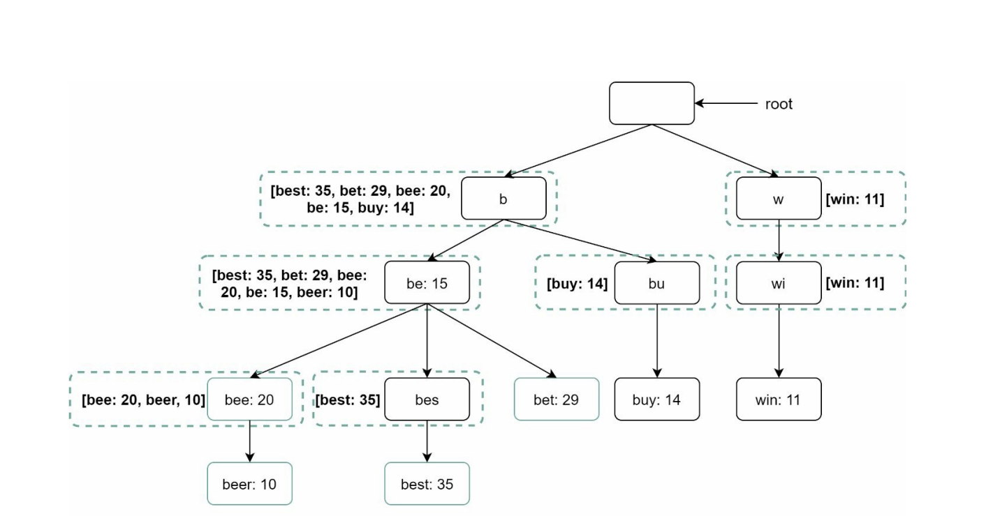

# Type Ahead or Search Auto complete system

## Clarifying Qs:
1. Should the system support suggestions based on prefix or chars in the middle ? Ans:prefix
2. How many suggestions ? Ans: 5
3. Assume English as the language ? Ans: Yes. But do explain language specific nuances
4. Any specific criteria to rank the suggestions ? Ans: Popularity (count frequency)
5. Can I assume all chars are lower case to keep the conversation simple ? In practice we might need to normalize. Ans: Yes
6. Support spell-check ? Ans: Not needed (but interesting to mention how to tackle it)

## Functional Requirements
1. suggestions based on prefix
2. rank based on most popular by frequency count

## Non Functional
1. prioritize availability >> consistency
2. scalable as search traffic grows
3. low latency (<=100ms)
4. Wait for 160ms before firing a query as inter type latency is typically ~ 160 ms 

## Estimates 
Estimates are good to get a sense of the capacity needed now and in the future. Also informs us if we need to shard DB if needed

1. DAU - 1B users
2. Each user executes 10 searches/ day
3. Assume each search query contains 4 words on an avg and each word has 5 characters. Assuming ASCII encoding 1 char == 1 Byte we need 4 x 5 = 20 Bytes per query
4. On avg 4 x 5 = 20 chars are sent per query
5. 1B x 10 x 4 x 5 = 200 B requests / day. 200B/100000 ~ 2M rps. Assume peak ~ 2 RPS ~ 4M rps 
6. 200 B requests / day x 1 = 200 B requests per day x 1 byte = 200 GB /day. 200 Gb / day x 30 = 6000 GB / month = 6 TB/month.
7. Assume 20 % of daily requests are new ~ 200 GB/ day x 0.2 = 40 GB / day of storage is added per day.

A good data structure to use is a Trie data struture. 
Assume p - prefix, c - number of children
Algo: traverse p nodes and traverse all children. Assume the leaf node stores the frequency. So we need to sort all children. 
Cost: O(p) + O(c) + O(clogc)
Optimizations:
Store the top 5 results in each inner node. This takes up space but it is a good trade-off to gain performance.

 
   
